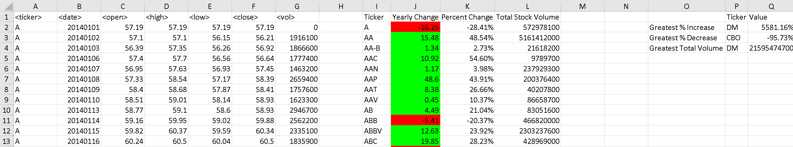
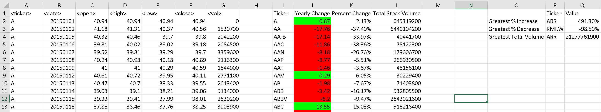
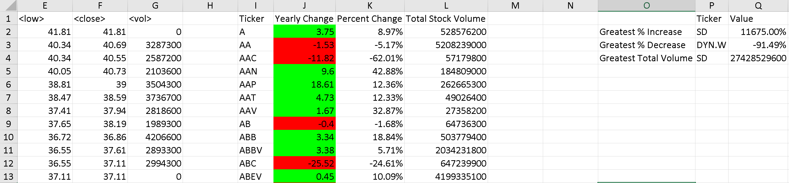

# VBA Challenge - The VBA of Wall Street

## Description

The file Module2.bas has sub WorksheetLoop that calls sub stocks within Module1.bas to run the stocks macro each worksheet in the workbook.  After starting WorksheetLoop, the user is prompted on whether they want to run the stocks macro on the whole workbook or just the active sheet.

## Screen shots

### 2014

### 2015

### 2016

